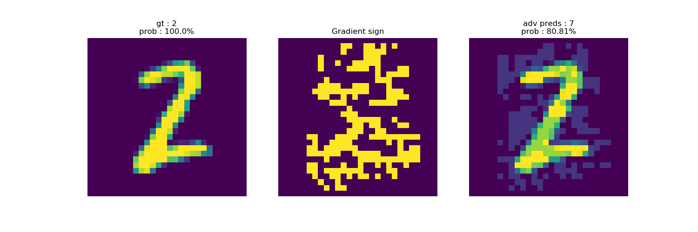

# ***Confidence Conditioned Knowledge Distillation***

Unofficial implementations of paper ***Confidence Conditioned Knowledge Distillation*** by Sourav Mishra, Suresh Sundaram.

Paper addr: https://arxiv.org/pdf/2107.06993.pdf

## Backgrounds
In this paper, authors propose a new 'response' type of distillation method, called Confidence 
Conditional Knowledge Distillation(CCKD). In the original Hinton's KD, they don't believe it is good enough 
to give the same weight to each sample, so they propose to give different weights to different samples 
during student training. In particular, they use dot product between one-hot ground-truth label
and teacher's softmax to get balance parameter, which is a vector for different samples instead of 
a simple hard number.

They also propose three different methods, CCKD-L, CCKD-T, and CCKD-T-REG. All methods are illustrated
in the following:


CCKD-L is loss function-level method, however CCKD-T is target-level method. in CCKD-T,


And in implementation, I've noticed that in the algorithm, authors only use temperature in student,
but for me, I also use temperature in y_T.

For CCKD-T-REG, it is CCKD-T with self-regulation, self-regulation is a technique which adopts 
less example in training to save computation resource. More specifically, CCKD-T-REG is given as,


Whole algorithm for CCKD-T-REG is,


For more details and notations, please read the paper.

## Requirements

```Python
pip install -r requirements.txt 
```

## Experiments

In this part, I re-produce some of results from the paper. 

- Image classification for MNIST, Fashion MNIST, CIFAR10.
- Does student that uses CCKD repeat teacher's errors?
- Adversarial attack using FGSM.
- Model params counting.

In this repo, according to paper, they use LeNet5Half and AlexNetHalf as students for 
different datasets, however they don't release the exact architectures of these models, I
just build them with half of channels compared to teachers.

### Hyper-parameters and defaults

```bash
--data_root: default is './data/'
--dataset: data set name, default is 'cifar10', 'mnist', 'fashion_mnist'

--distill: True for distillation False then 'train_s' will work
--baseline: False for training student solely
--temperature: default is 1.
--lambd: hyperparameter, default is 0.3
--alpha: hyperparameter in self-regulation, default is 0.01
--distill_type: 'kd' f32or Hinton's method, 'cckd_t'/'cckd_l'/'cckd_t_reg'

--batch_size: default is 32
--epochs: default is 160
--optimizer: default is 'adamw', also support 'adam'/'momentum'
--init_lr: default is 1e-5
--gamma: learning rate decay rate, default is 0.2
--milestones: we use steplr decay, default is [30, 60, 90, 120, 150]
--weight_decay: default is 1e-5

--fgsm: for adversarial attack, default is False
--epsilon: step size for FGSM
--repeat_error_ver: repeat error verification in Experiment 4.6 in the paper?
    default is False
```


### Train & Test

Running command:

```python

Usage:
    1. Run 
        python main.py main \
            --data_root='./data/' \
            --dataset='mnist' \
            --distill=True \
            --baseline=False \
            --temperature=1. \
            --lambd=0.3 \
            --alpha=0.01 \
            --distill_type='kd' \
            --batch_size=32 \
            --epochs=160 \
            --optimizer='adam' \
            --init_lr=1e-5 \
            --gamma=0.2 \
            --milestones=[30,60,90,120,150] \
            --weight_decay=1e-5 \
            --fgsm=False \
            --epsilon=0.01 \
            --repeat_error_ver=False \
            --only_test=False

    2. Simply run
        python main.py main --dataset='cifar10' --distill=False --baseline=False --temperature=1.5 --distill_type='kd' --batch_size=32 --epochs=20 --fgsm=True --epsilon=1e-3 --repeat_error_ver=False --only_test=False
    
    3. Run scripts
        ./run.sh

```

## Results

We run three times of each experiment, and average the results.

### Image Classification

#### MNIST
| Model           | Acc.        |
| ----------------- | ----------- |
| Teacher      	    | <font color='green'>99.17%</font>      |
| Student Baseline     | 98.95%      |
| Hinton's KD         | <font color='red'> **99.11%** </font>      |
| CCKD-L         | 98.97%      
| CCKD-T         | 99.01%      |
| CCKD-T-REG         | 98.91%      |

#### Fashion MNIST
| Model           | Acc.        |
| ----------------- | ----------- |
| Teacher      	    | <font color='green'>90.57% </font>     |
| Student Baseline     | 89.56%      |
| Hinton's KD         | 89.4%      |
| CCKD-L         | 90.01%      
| CCKD-T         | <font color='red'> **90.24%** </font>     |
| CCKD-T-REG         | 90.12%      |

#### CIFAR10
| Model           | Acc.        |
| ----------------- | ----------- |
| Teacher      	    | <font color='green'>88.77%</font>      |
| Student Baseline     | 87.82%      |
| Hinton's KD         | 87.94%      |
| CCKD-L         | 88.31%      
| CCKD-T         | <font color='red'> **88.41%** </font>     |
| CCKD-T-REG         | 88.21%      |


### Does student that uses CCKD repeat teacher's errors?

In this section, they tend to calculate how student models behave in
examples where teacher models make mistakes. They use two metrics:


In my implementation, for mu_F, I use log of it to avoid data underflow.
**Note:** In my implementations, I don't get the same results as paper gives,
especially for MNIST, maybe because for MNIST, the improvement is very negligible.

#### MNIST
| Model           | mu_S        | mu_F       |
| ----------------- | ----------- | ----------- |
| Hinton's KD         |  **0.12**   | **-19.5**|
| CCKD-L         | 0.11      |-18.97|
| CCKD-T         | 0.09      |-19.27|
| CCKD-T-REG         | 0.10      |-18.50|

#### Fashion MNIST
 Model           | mu_S        | mu_F       |
| ----------------- | ----------- | ----------- |
| Hinton's KD         |  0.38   | -6.64|
| CCKD-L         | 0.37      |-7.62|
| CCKD-T         | **0.4**     |**-7.65**|
| CCKD-T-REG         | 0.38      |-7.95|

#### CIFAR10
 Model           | mu_S        | mu_F        |
| ----------------- | ----------- | ----------- |
| Hinton's KD         |  0.33   | -7|
| CCKD-L         | 0.33      |**-7.99**|
| CCKD-T         | 0.33      |-7.43|
| CCKD-T-REG         | 0.33     |-7.21|

### Adversarial attack using FGSM

In this section, I put stronger on the adversarial attack, so the results are more strict than in paper.

#### MNIST (step size = 0.15)
| Model           | Acc.        |
| ----------------- | ----------- |
| Teacher      	    | 46.4%      |
| Student Baseline     | 46.11%      |
| Hinton's KD         | 40.7%     |
| CCKD-L         | 43.37%      
| CCKD-T         | 62.4%      |
| CCKD-T-REG         | <font color='red'> **64.3%** </font>      |

I will illustrate best results from CCKD-T-REG.





#### Fashion MNIST (step size = 0.05)
| Model           | Acc.        |
| ----------------- | ----------- |
| Teacher      	    | 34.56%      |
| Student Baseline     | 33.99%      |
| Hinton's KD         | 36.3%      |
| CCKD-L         | 42.74%      
| CCKD-T         | <font color='red'> **43.57%** </font>     |
| CCKD-T-REG         | 37.7%      |

I will illustrate best results from CCKD-T.


#### CIFAR10 (step size = 0.05)
| Model           | Acc.        |
| ----------------- | ----------- |
| Teacher      	    | 65.04%      |
| Student Baseline     | 61.73%      |
| Hinton's KD         | 64.39%      |
| CCKD-L         | <font color='red'> **65.15%** </font>     
| CCKD-T         | 64.79%     |
| CCKD-T-REG         | 64.55%      |

I will illustrate best results from CCKD-L.


### Model params counting
| Model           | # of params        |
| ----------------- | ----------- |
| LeNet(modified)     	    |     ~60K  |
| LeNetHalf     |    ~20K   |
| AlexNet(modified)         |   ~23.47M   |
| AlexNetHalf         | ~5.88M|     

## Citation

```
@misc{mishra2021confidence,
      title={Confidence Conditioned Knowledge Distillation}, 
      author={Sourav Mishra and Suresh Sundaram},
      year={2021},
      eprint={2107.06993},
      archivePrefix={arXiv},
      primaryClass={cs.LG}
}
```


***<center>Veni，vidi，vici --Caesar</center>***
